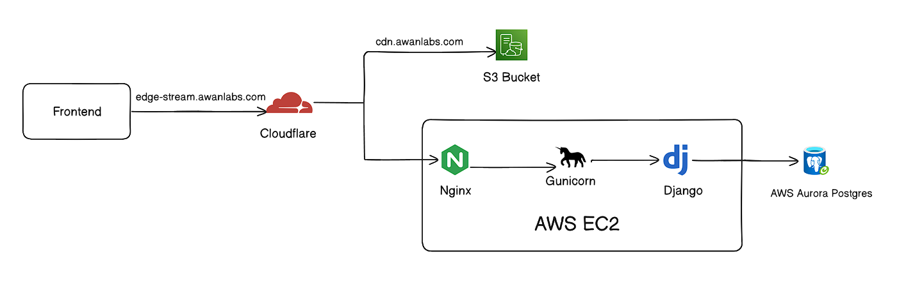

# 🎬 Edge-Stream

## Bringing Content Closer to the User

**Edge-Stream** is a cloud-based streaming platform designed around the concept of delivering content closer to users based on their geographical location.

The project demonstrates how modern web applications can combine a scalable frontend and backend with cloud storage and CDN infrastructure to deliver media efficiently.

Rather than simply functioning as a streaming application, Edge-Stream explores the architecture behind modern content delivery platforms.

---

## 🌐 Project Overview

Streaming large media files directly from a central application server can result in:

* Increased latency for geographically distant users
* Higher load on backend servers
* Slow media delivery
* Limited scalability

Edge-Stream addresses this by separating the **application layer** from the **media delivery layer**.

The application backend manages users, authentication, movie metadata, and access control, while media assets are stored and delivered through cloud infrastructure and CDN services.

```text
                     ┌──────────────────┐
                     │      Users       │
                     └────────┬─────────┘
                              │
                              ▼
                     ┌──────────────────┐
                     │  React Frontend  │
                     └────────┬─────────┘
                              │
                              ▼
                    ┌────────────────────┐
                    │   Django REST API   │
                    │ Authentication/API  │
                    └─────────┬──────────┘
                              │
              ┌───────────────┼────────────────┐
              │               │                │
              ▼               ▼                ▼
        ┌───────────┐   ┌───────────┐   ┌─────────────┐
        │ PostgreSQL│   │ AWS S3    │   │ Cloud CDN   │
        │ Database  │   │ Media     │   │ Edge Delivery│
        └───────────┘   └───────────┘   └─────────────┘
```

---

# ✨ Features

## 🎥 Media Streaming

* Browse available movies and content
* Stream media through CDN infrastructure
* Media files stored separately from the application backend
* Designed to reduce latency for geographically distributed users

## 🔐 Authentication

* User registration
* Secure login using JWT authentication
* Protected API endpoints
* Email verification workflow through SMTP server
* User profile management

## 👤 User Management

Users can:

* Create an account
* Verify their email
* Log in securely
* Update profile information
* Delete their account

## 🔍 Content Discovery

* Search movies
* Browse available content
* View movie details
* Access media through secure URLs

---

# 🏗️ Architecture

Edge-Stream follows a distributed architecture where responsibilities are separated between different services.

## Frontend

The frontend is built using:

* React
* Vite
* Tailwind CSS
* Axios

The frontend communicates with the Django REST API and handles the user interface, authentication flow, content discovery, and video playback.

---

## Backend

The backend is built using:

* Python
* Django
* Django REST Framework

The backend is responsible for:

* User authentication
* JWT token management
* Email verification
* Movie metadata
* API endpoints
* Secure communication with cloud services
* Uploading media

---

## Database

The application uses Aurora RDS database for storing:

* User information
* Authentication-related data
* Movie metadata
* Application data

The database is separated from the application server to support better scalability and production-style deployment.

---

## Cloud Storage

Media files are stored in cloud object storage rather than directly on the application server.

This approach provides several advantages:

* Reduced server storage requirements
* Better scalability
* Easier management of large media files
* Integration with CDN infrastructure

---

## CDN and Edge Delivery

Edge-Stream is designed around the principle of delivering media through geographically distributed infrastructure.

Instead of every user retrieving content directly from a single backend server, media delivery can be handled through CDN edge locations.Media contents are proxied through the cloudflare CDN which caches frequently accessed data closer to the location of the user

```text
User
 │
 ▼
Nearest Edge Location
 │
 ▼
Cached / Retrieved Media
 │
 ▼
Cloud Storage Origin
```

This architecture can help reduce:

* Latency
* Load on the origin infrastructure
* Long-distance media requests

---

# 🛠️ Technology Stack

## Frontend

* React
* Vite
* Tailwind CSS
* Axios

## Backend

* Python
* Django
* Django REST Framework
* JWT Authentication

## Database

* PostgreSQL
* Amazon Aurora / RDS

## Services

* Brevo email

## Cloud Infrastructure

* AWS EC2
* Amazon S3
* CDN Infrastructure
* Cloudflare
* Nginx

## DevOps

* Docker
* Docker Compose
* GitHub Actions
* Nginx
* Gunicorn

---

# 🔐 Authentication Flow

Edge-Stream uses JWT-based authentication.

```text
User Login
    │
    ▼
Django Authentication
    │
    ▼
JWT Generated
    │
    ▼
Frontend Stores Token
    │
    ▼
Token Sent With Protected Requests
```

Protected endpoints require valid authentication credentials.

---

# ✉️ Email Verification

New users go through an email verification workflow.

```text
User Registration
       │
       ▼
Verification Link Generated
       │
       ▼
Email Sent
       │
       ▼
User Opens Verification Link
       │
       ▼
Account Verified
```

The verification system uses secure, time-sensitive tokens to prevent unauthorized verification attempts. Even if the token is intercepted the user still has to input password for login.

---

# ☁️ Cloud Architecture

Edge-Stream separates application services from media delivery.



---

# 🐳 Containerization

The project uses Docker to containerize application services.

Containerization provides:

* Consistent development environments
* Simplified deployment
* Service isolation
* Easier infrastructure management
* Less configuration hurdle

The application can run using Docker Compose with services such as:

* Frontend
* Backend
* Database

---

# ⚙️ CI/CD

Edge-Stream uses GitHub Actions to automate deployment workflows.

The CI/CD pipeline can:

1. Detect changes pushed to the repository
2. Create terminal connection with vm
3. Build or prepare the application
4. Inject environment variables
5. Deploy updated application services

This reduces manual deployment steps and makes the deployment process more consistent.

---

# 🚀 Key Concepts Demonstrated

This project demonstrates practical experience with:

* REST API development
* JWT authentication
* Email verification systems
* Cloud object storage
* CDN architecture
* Edge content delivery
* Reverse proxies
* Containerization
* Production deployments
* CI/CD pipelines
* Database infrastructure
* Cloud service integration

---

# 🎯 Project Goal

The primary goal of Edge-Stream is to explore how a modern streaming platform can be architected using cloud infrastructure.

The project focuses not only on building a user-facing streaming application but also on understanding the infrastructure required to deliver media efficiently.

Key architectural principles include:

* Separating application and media infrastructure
* Using cloud object storage for large media assets
* Delivering content through geographically distributed infrastructure
* Reducing load on application servers
* Designing services that can scale independently

---

# 🔮 Future Improvements

Potential future improvements include:

* Adaptive bitrate streaming
* Video transcoding pipelines
* Automatic thumbnail generation
* Multiple video quality options
* Recommendation system
* Watch history
* Continue watching functionality
* User watchlists
* Advanced search and filtering
* Analytics and monitoring
* Auto-scaling infrastructure
* Improved CDN caching strategies
* Cloudflare worker for presigned access to s3

---

# 👨‍💻 Author

**Jahanzaib Awan**

Computer Science Graduate | Backend & Cloud Developer

---

## ⭐ Why Edge-Stream?

Edge-Stream was built to go beyond a traditional CRUD web application.

The project combines **backend engineering, frontend development, cloud infrastructure, CDN concepts, containerization, and automated deployment** to demonstrate how modern applications can separate compute workloads from large-scale media delivery.

The central idea behind Edge-Stream is simple:

> **Build the application once, store content centrally, and deliver it efficiently from infrastructure closer to the user.**


## Common Problems Faced

## 🔒 SSL/TLS Configuration

For the production deployment of Edge-Stream, the SSL/TLS certificate was generated using **Cloudflare Origin Certificates** and configured on the Nginx server.

Alternatively, a self-signed SSL certificate can be generated using **OpenSSL** for development or testing environments.

When configuring SSL certificates with Nginx, it is important to ensure that the certificate and private key files are accessible to the Nginx process and that appropriate file permissions are configured. The certificate files must be readable by the Nginx service, while the private key should remain securely restricted to prevent unauthorized access.

The SSL configuration is then handled by Nginx, which terminates HTTPS connections before forwarding application requests to the backend server.


### 📁 Django Static Files

When serving Django static files through Nginx, ensure that the static files directory has the necessary read permissions. The parent directories must also be accessible by the Nginx user; otherwise, Nginx may return `403 Forbidden` errors even if the static files themselves are readable.

Additionally, ensure that `STATIC_URL` ends with a trailing forward slash:

```python
STATIC_URL = "/static/"
```

The trailing slash is important for Django's static file handling and helps ensure that assets used by the Django Admin panel, such as CSS and JavaScript files, are resolved correctly.

---

### 🗄️ Amazon Aurora RDS and IAM Authentication

This project uses **IAM database authentication tokens** to connect Django to the PostgreSQL database hosted on Amazon Aurora RDS.

IAM authentication tokens are temporary and expire after approximately **15 minutes**. Because of this, a token cannot simply be generated once and used indefinitely as the database password.

To handle token expiration, the database connection must be configured with a connection lifetime shorter than the token validity period. A connection refresh mechanism is also required to generate a new authentication token when a new database connection is established.

The connection refresh logic uses `boto3` to generate new IAM authentication tokens.

The implementation for handling Aurora RDS authentication is available in:

```text
/backend/aurora_rds
```

---

### 🔐 Environment Variables and SSH Keys

Environment variables used during deployment are injected through the **GitHub Actions CI/CD pipeline**.

However, GitHub Actions requires an SSH private key to establish a secure connection with the deployment server.

Handling multi-line SSH private keys directly as environment variables or repository secrets can sometimes cause formatting issues. A common solution is to encode the private key using **Base64** before storing it as a GitHub secret.

During deployment, the key is decoded and written to a temporary file before being used by the SSH client.

This approach helps preserve the original formatting of the private key and avoids issues caused by line breaks or special characters.

---

### ☁️ Cloudflare and Amazon S3 CDN Connection

Edge-Stream uses a dedicated `cdn` subdomain to serve media content through CDN infrastructure.

During the initial Cloudflare configuration, requests routed through the domain could result in **CORS (Cross-Origin Resource Sharing)** issues. This occurred because the request and origin configuration did not preserve the expected origin behavior when communicating with Amazon S3.

The solution was to use **Cloudflare Cloud Connector** to connect the CDN endpoint directly to the Amazon S3 origin.

Cloud Connector allows Cloudflare to proxy requests to the cloud storage origin while maintaining the required origin configuration. This helps prevent CORS issues caused by an unexpected origin mismatch and allows media content to be served correctly through the CDN endpoint.

```text
User
 │
 ▼
cdn.example.com
 │
 ▼
Cloudflare
 │
 ▼
Cloud Connector
 │
 ▼
Amazon S3 Bucket
```
